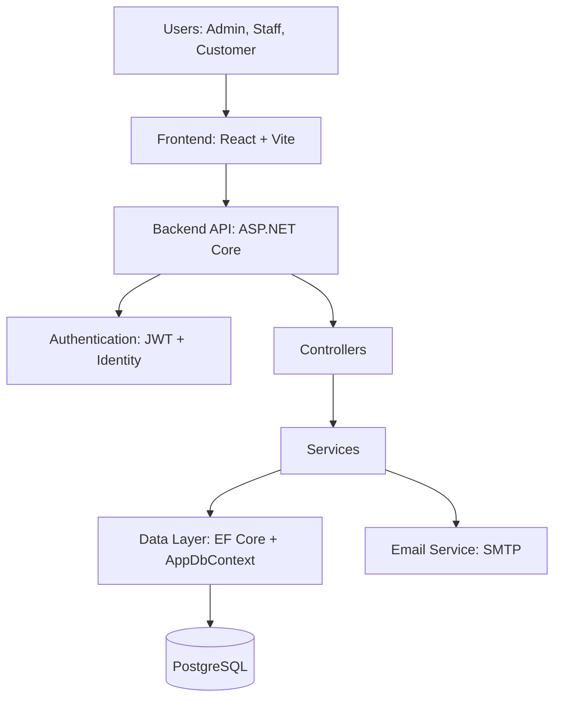
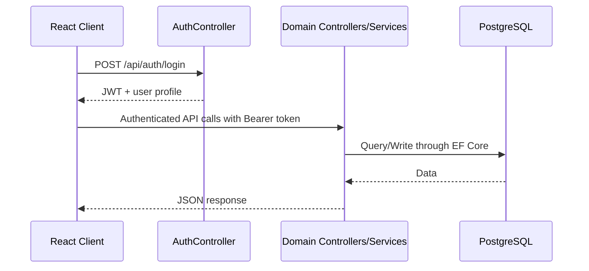

# Vehicle Parts and Service Management System (VPMS)

A full-stack role-based platform for managing vehicle parts inventory, sales transactions, customer vehicles, service appointments, vendor operations, and notifications.

This project demonstrates how a single business domain can be implemented with clean module separation, strong CRUD coverage, role-aware user journeys, and production-friendly deployment options.

## Table of Contents

- [Why This Project Stands Out](#why-this-project-stands-out)
- [Core Features](#core-features)
- [System Design and Architecture](#system-design-and-architecture)
- [Technology Stack](#technology-stack)
- [Project Structure](#project-structure)
- [API Modules Overview](#api-modules-overview)
- [Data Model Snapshot](#data-model-snapshot)
- [Local Development Setup](#local-development-setup)
- [Environment and Secrets Management](#environment-and-secrets-management)
- [Docker (Backend)](#docker-backend)
- [Recruiter-Focused Project Highlights](#recruiter-focused-project-highlights)

## Why This Project Stands Out

VPMS is designed around real operational workflows seen in parts and service businesses:

- Multi-role access model with different experiences for Admin, Staff, and Customer
- End-to-end inventory lifecycle: vendors, parts, low-stock tracking, purchase and sale flows
- Customer lifecycle features: registration, vehicle profile management, history, and service requests
- Transaction workflows including invoice generation and email notifications
- Reporting module for revenue and customer insights
- Modern frontend architecture with React, Vite, and route-based portals

## Core Features

### Authentication and Account Management

- JWT-based authentication
- ASP.NET Core Identity integration
- Forgot password, OTP verification, and reset password flow
- User status toggling and password change endpoints

### Admin Capabilities

- Staff creation and management
- Customer oversight
- Inventory and vendor management access
- Revenue and customer report access

### Staff Capabilities

- Customer management and segmentation flows
- Sales processing and invoice-related flows
- Appointment handling
- Part inventory operations

### Customer Capabilities

- Sign up and login flows
- Vehicle registration and updates
- Service booking and request flows
- View service history and purchase history

### Notifications and Reports

- Role-aware notifications
- Low-stock notifications
- Revenue and customer analytics endpoints
- Reminder email workflows for unpaid invoices

## System Design and Architecture

VPMS follows a modular full-stack architecture:

- Frontend: React SPA with role-based route sections
- Backend: ASP.NET Core Web API with controller-service-data layering
- Data Access: Entity Framework Core with PostgreSQL
- Auth and Security: ASP.NET Core Identity + JWT bearer authentication

### High-Level Architecture



### Request Flow



## Technology Stack

### Frontend

- React 18
- React Router
- Vite
- Recharts
- jsPDF and jsPDF-AutoTable

### Backend

- .NET 8 (ASP.NET Core Web API)
- Entity Framework Core 8
- PostgreSQL provider (Npgsql)
- ASP.NET Core Identity
- JWT Bearer Authentication
- MailKit
- Swashbuckle (Swagger)

## Project Structure

```text
vpms/
├─ backend/
│  ├─ VehicleInventorySystem.Api/
│  │  ├─ Configuration/              # Strongly typed Jwt and SMTP settings
│  │  ├─ Controllers/                # API endpoints by domain and role
│  │  ├─ Data/                       # AppDbContext and EF model configuration
│  │  ├─ DTOs/                       # Request and response contracts
│  │  ├─ Extensions/                 # Query and utility extensions
│  │  ├─ Middleware/                 # Global exception handling middleware
│  │  ├─ Migrations/                 # EF Core migration history
│  │  ├─ Models/                     # Domain entities
│  │  ├─ Services/                   # Interfaces and implementations
│  │  ├─ Program.cs                  # Dependency injection and app pipeline
│  │  └─ VehicleInventorySystem.Api.csproj
│  └─ VPMS.csproj
├─ frontend/
│  └─ VehicleInventorySystem.Web/
│     ├─ src/
│     │  ├─ components/              # Shared and role-specific UI components
│     │  ├─ context/                 # Toast and shared contexts
│     │  ├─ pages/                   # Portal pages: admin, staff, customer, auth
│     │  ├─ services/                # API client and auth calls
│     │  ├─ styles/                  # Visual system styles
│     │  ├─ utils/                   # Utility helpers
│     │  ├─ App.jsx                  # Main route composition
│     │  └─ main.jsx
│     ├─ index.html
│     ├─ package.json
│     └─ vite.config.js
├─ Dockerfile                        # Backend containerization
├─ VPMS.slnx
└─ PROJECT_ANALYSIS.md
```

## API Modules Overview

Main controller groups in the backend:

- AuthController: login, customer registration, forgot password, OTP verification, password reset
- UsersController: user listing, staff management, status updates, password changes
- CustomersController and CustomerHistoryController: customer and vehicle history operations
- InventoryController, PartsController, VendorsController: inventory and procurement management
- ServiceController: appointments, part requests, service reviews, special requests, service invoice flow
- TransactionsController: purchase, sale, invoice retrieval, recent and sales data
- ReportsController: revenue and customer report endpoints, reminders
- NotificationsController and AdminController: notification-focused administration

## Data Model Snapshot

The EF Core context includes these major aggregates:

- Users and roles (Identity tables + User entity)
- Vendors and Parts
- Vehicles
- Appointments and service reviews
- Invoices and invoice items
- Part requests and special part requests
- System notifications

## Local Development Setup

### Prerequisites

- .NET SDK 8.x
- Node.js 18+ and npm
- PostgreSQL instance

### 1) Clone and Restore

```bash
git clone <your-repo-url>
cd vpms
```

### 2) Backend Setup

```bash
cd backend/VehicleInventorySystem.Api
dotnet restore
dotnet ef database update
dotnet run
```

Backend defaults:

- API base: http://localhost:5169
- Swagger UI: http://localhost:5169/swagger

### 3) Frontend Setup

```bash
cd frontend/VehicleInventorySystem.Web
npm install
npm run dev
```

Frontend defaults:

- App URL: http://127.0.0.1:5173

### 4) Frontend to Backend Configuration

The frontend API target is controlled by Vite environment variables.

Create a .env file in frontend/VehicleInventorySystem.Web:

```env
VITE_API_BASE_URL=http://localhost:5169/api
```

## Environment and Secrets Management

Use environment variables or secret managers for all sensitive values:

- ConnectionStrings__DefaultConnection
- Jwt__Key
- Jwt__Issuer
- Jwt__Audience
- SmtpSettings__Host
- SmtpSettings__Port
- SmtpSettings__Username
- SmtpSettings__Password
- SmtpSettings__FromEmail

Important: If secrets were ever committed in tracked files, rotate them immediately before public sharing.

## Docker (Backend)

The provided Dockerfile builds and runs the backend API and exposes port 10000.

```bash
docker build -t vpms-api .
docker run -p 10000:10000 vpms-api
```

API in container:

- http://localhost:10000

## Authentication Notes

- JWT bearer auth is enabled in backend startup pipeline
- Identity roles seeded at startup: Admin, Staff, Customer
- A default admin bootstrap account may be created by startup logic for first-run scenarios

## Quality and Engineering Notes

Current codebase strengths:

- Strong module coverage across business operations
- Clear separation of controllers, services, DTOs, and data layer
- Centralized exception middleware
- Route-structured frontend with role-based layouts

Potential next improvements:

- Add integration and unit test suites
- Tighten CORS policies per environment
- Add CI workflow for build, lint, and test automation
- Introduce secrets vault integration and config hardening

## Recruiter-Focused Project Highlights

This project demonstrates:

- Full-stack product thinking from UI routes to domain APIs and persistence
- Practical use of identity, JWT auth, and role-driven UX
- Real business workflow modeling for inventory and service operations
- Clean API contract structure using request and response DTOs
- Deployment readiness with Dockerized backend

## License

Add a license file if you plan to open-source this project publicly.

## Contact

If you are using this as a portfolio project, include your name, email, LinkedIn, and a short note about your role and contributions.
